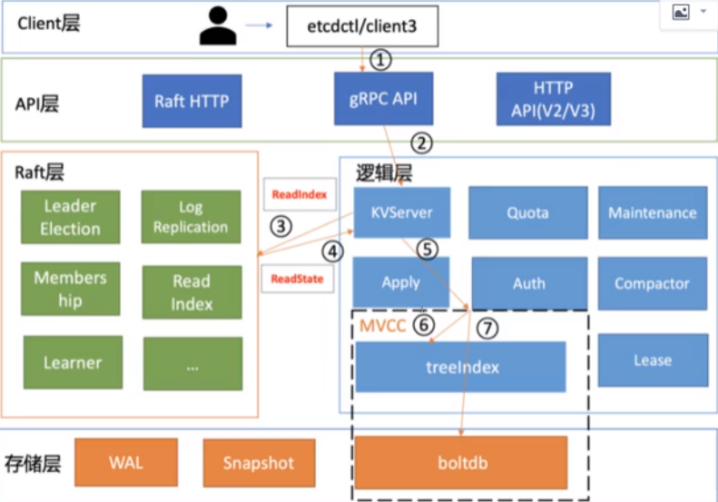

# etcd读请求执行流程
etcd是典型的读多写少存储， 在我们实际业务场景中，读一般占据2/3以上的请求， 一个读请求从client通过round-robin负载均衡算法，选择一个etcd server节点，
发出grpc请求，经过etcd server的KVserver模块，线性读模块，mvcc的treeIndex和 boltdb模块紧密协作，完成了一个读请求


```shell
$ etcdctl get test --endpoints 
```

## etcdctl 会对命令中的参数进行解析
- get 是请求的方法， 它是 KVserver模块的API
- test 是我们查询的KEY名
- endpoints 是后端的etcd地址，通常，生产情况下需要配置多个endpoints，这样在etcd节点出现故障后，client就可以自动重连其他正常的节点，从而保证请求正常执行、

## 在解析完请求参数后，etcdctl会创建一个clientv3 库的对象，使用 KVServer 模块的API来访问etcd server
- etcd clientv3 库采用的负载均衡算法为 Round-robin。针对每个请求，Round-robin算法通过轮询的方式依次从endpoint列表中选择一个endpoint访问（长连接）,使etcd server负载尽量均衡

## KVServer与拦截器

### client发送range rpc请求到server后进入 KVServer模块
etcd通过拦截器以非法入侵式的方法实现了许多的特性， 例如：丰富的metrics、日志、请求行为检查、所有请求的执行耗时及错误码、来源IP等。
拦截器提供了在执行一个请求前后的hook能力，除了debug日志、metrics统计、对etcd learner节点请求接口和参数限制等能力，etcd还基于它
实现了一下特性
- 要求执行一个操作前，集群必须有leader
- 请求延时超过指定阈值的，打印包含来源IP的慢日志查询日志（3.5版本）

server 收到client的range rpc请求后,根据serviceName 和rpc Method将请求转发到对应的handler实现，handler首先会将上面描述的一系列拦截器串联成一个拦截器再执行，再拦截器逻辑中，通过调用KVServer
模块的Range接口获取数据。

## 串行读与线性读
> etcd为了保证服务高可用，生产环境一般部署多个节点，多个节点之间的数据由于延迟等关系可能会存在不一致的情况

当etcd发起一个写请求后分为一下几个步骤
1. Leader收到写请求，他会将此请求持久化到WAL日志，并广播给各个节点
   - 只有Leader节点能处理写请求
2. 若一半以上节点持久化成功，则该请求对应的日志条目被标识已提交
3. etcdserver模块异步请求从Raft模块获取已提交的日志条目，应用到状态机（boltdb等）

此时若client发起一个读取test的请求，假设此请求直接从状态机中读取，如果连接的是C节点，若C节点磁盘I/O出现波动，可能导致它的应用已提交的日志条目很慢，则会出现更新test为world的写命令，在client读
test的时候还未被提交到状态机，因此就可能读取到旧数据

所以在多节点etcd集群中，各个节点的状态机数据一致性存在差异。而我们不同业务场景的读请求对数据是否最新的容忍度是不一样的。根据业务场景对数据一致性差异的接受程度， etcd中有两种读模式
1. 串行读：直接读状态机数据返回、无需通过raft协议与集群进行交互，具有低延时、高吞吐量的特点，适合对数据一致性要求不高的场景
2. 线性读：etcd默认读模式为线性读，需要经过raft协议模块、反应的是集群共识、因此在延时和吞吐量上相比串行读略差一点，适用于对数据一致性要求高的场景

## readIndex
etcd 3.1时引入了Readindex机制，保证在串行读的时候，也能读到最新的数据
- 当收到一个线性读请求时，它首先会从Leader获取集群最新的已提交的日志索引（committed index）
- Leader接收到ReadIndex请求时，为防止脑裂等异常场景，会向Follower节点发送心跳确认，一半以上节点确认Leader身份后，才能将已提交的索引（committed index）返回给节点C
- 节点会等待，直到状态机已应用索引（applied index）大于Leader的已提交索引时（committed index），然后通知读请求，数据已赶上Leader，可以去状态机访问数据

以上是线性读通过ReadIndex机制保证数据一致性原理，早期在etcd3.0，读请求通过走一遍Raft协议保证一致性，这种Raft log read机制依赖磁盘IO，性能比ReadIndex较差

KVServer模块收到线性读请求后，向Raft模块发起ReadIndex请求， Raft模块将Leader最新的已提交日志索引封装在ReadState结构体，通过Channel层层返回给线性读模块，
线性读模块等待本节点状态机追赶上Leader进度，追赶完成后，旧通知KVServer模块，与状态机中的MVCC模块进行交互

## MVCC
多版本并发控制（Multiversion concurrency control）模块是为了解决etcd v2不支持保存Key的历史版本，不支持多Key事务等问题而产生的。他核心`由内存树索引模块（treeIndex）和嵌入式的KV持久化存储库boltdb组成`
boltdb是个基于B+ tree实现的Key-value键值库，支持事务，提供Get/Put等简易API给etcd操作  
etcd MVCC具体方案如下
- 每次修改操作，生产一个新的版本号，以版本号为key， value为用户key-value等信息组成的结构体存储到blotdb
- 读取时先从treeIndex中获取key版本号，再以版本号作为blotdb的key， 从blotdb中获取value信息

