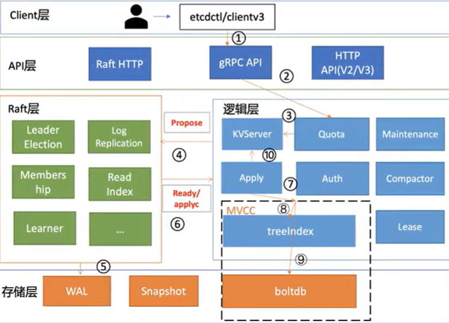

# etcd写请求执行流程
```shell
etcdctl put test test --endpoints 127.0.0.1:2379
```



1. client端通过负载均衡算法选择一个etcd节点，发起grpc调用
2. etcd节点收到请求后经过grpc拦截器、Quota模块后，进入KVServer模块
3. KVServer模块向Raft模块提交一个提案，提案内容为"大家好，请使用PUT方法执行一个key为test value为test的命令"
4. 随后此提案通过RaftHTTP网络模块转发、经过集群多数节点持久化后，状态会变成已提交
5. 